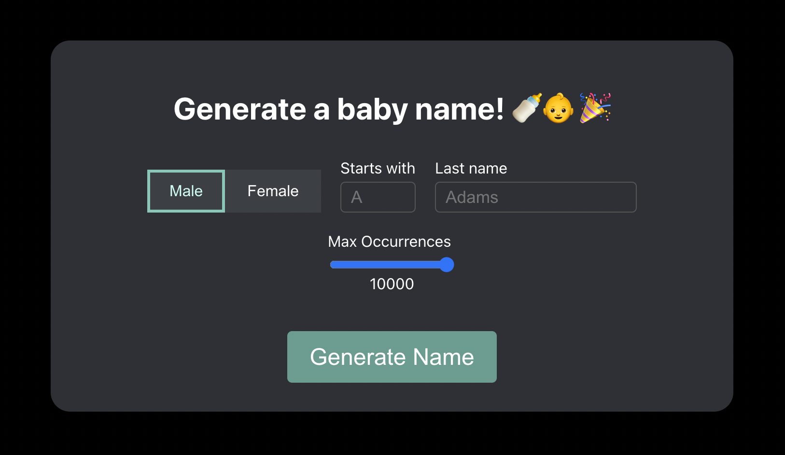

# Baby Name Generator



## Getting Started

1. Clone the repo.

2. Generate the data by running `node scripts/createJSONFiles.js`.

3. Execute:

```
yarn && yarn start
```

The project should now be running locally!
